# Team101 — Fin101

## Takım Üyeleri
* **Fatımanur Kantar** – Product Owner
* **Özlem Kılıç** – Scrum Master
* **Berat Muhammet Demirtaş** – Developer
* **Melike Kahraman** – Developer
* **İbrahim Emin İpek** – Developer

## Ürün Açıklaması
Bu proje, özellikle genç kullanıcılara yönelik geliştirilen yapay zekâ destekli bir finansal okuryazarlık ve yatırım bilgilendirme platformudur.
Platform, kullanıcıların finansal farkındalıklarını artırmayı ve borsa hakkında bilinçli kararlar alabilmelerini desteklemeyi amaçlamaktadır.

Kullanıcılar sanal bakiye ile borsa simülasyonu yaparak gerçek para riski olmadan alım-satım deneyimi kazanabilir. Ayrıca yapay zekâ destekli chatbot ve güncel finansal haberler sayesinde piyasa gelişmeleri takip edilebilir ve finansal konularda bilgi edinilebilir.

Ürün, yatırım tavsiyesi sunmak yerine bilgilendirici ve yönlendirici bir yaklaşım benimseyerek finansal okuryazarlığın gelişmesine katkı sağlamayı hedeflemektedir.

## Ürün Özellikleri

### 💰 Sanal Borsa Simülasyonu
* Sanal bakiye ile alım-satım işlemleri yapılabilir
* Gerçek para riski olmadan yatırım deneyimi kazanılır

### 🤖 Yapay Zekâ Destekli Chatbot
* Finansal konularda kullanıcı sorularını yanıtlar
* Bilgilendirici ve yönlendirici destek sağlar (RAG destekli Sokratik Mentor)

### 📰 Piyasa ve Haber Takibi
* Güncel borsa haberleri görüntülenir
* API aracılığıyla finansal gelişmeler takip edilir

### 📊 Dashboard
* Kullanıcı bakiye ve işlem geçmişi görüntülenir
* Tüm modüllere tek ekrandan erişim sağlanır

### 👤 Kullanıcı Profili
* Kullanıcı bilgileri ve hesap ayarları yönetilir

## Planlanan Sayfalar
* Dashboard
* Borsa Simülasyonu
* Haberler
* Chatbot
* Profil

## Arayüz Tasarımları

### Dashboard
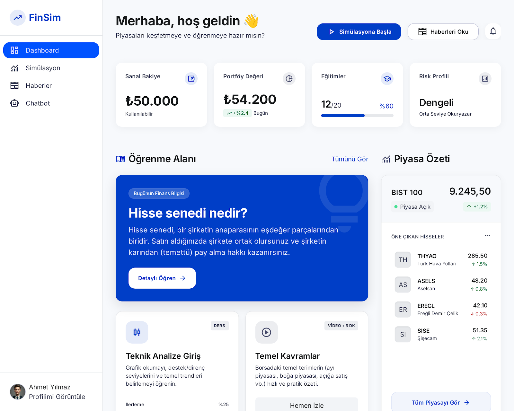

### Borsa Simülasyonu
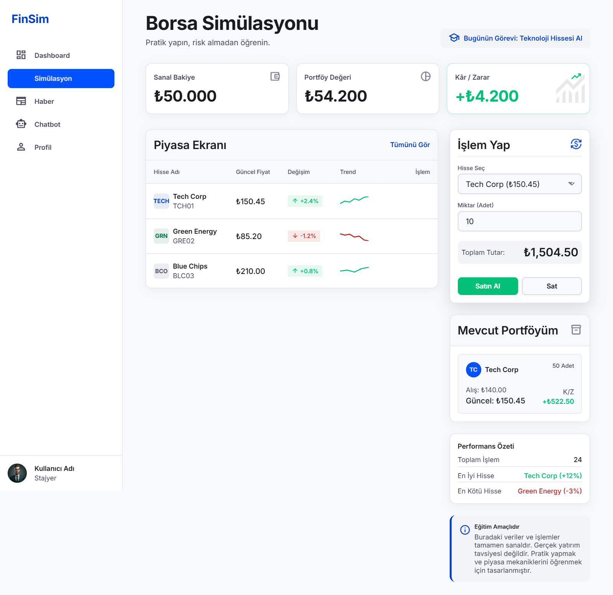

### Haberler
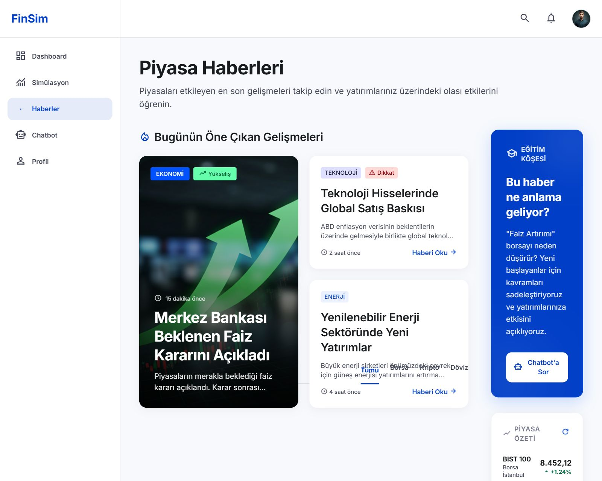

### Chatbot
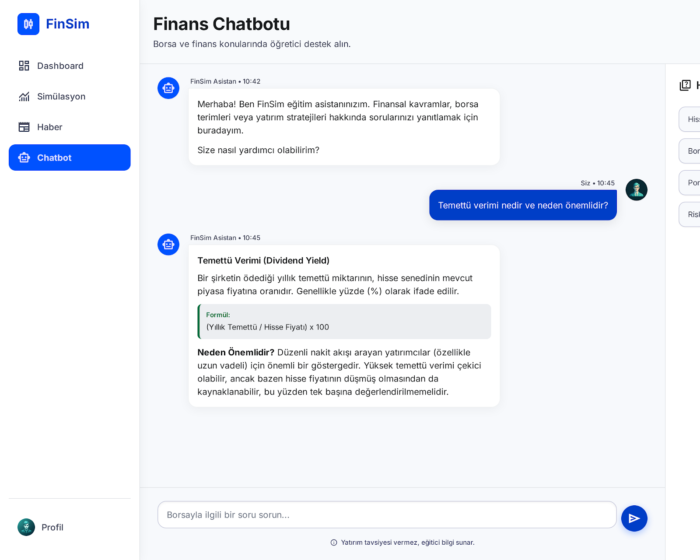

### Profil
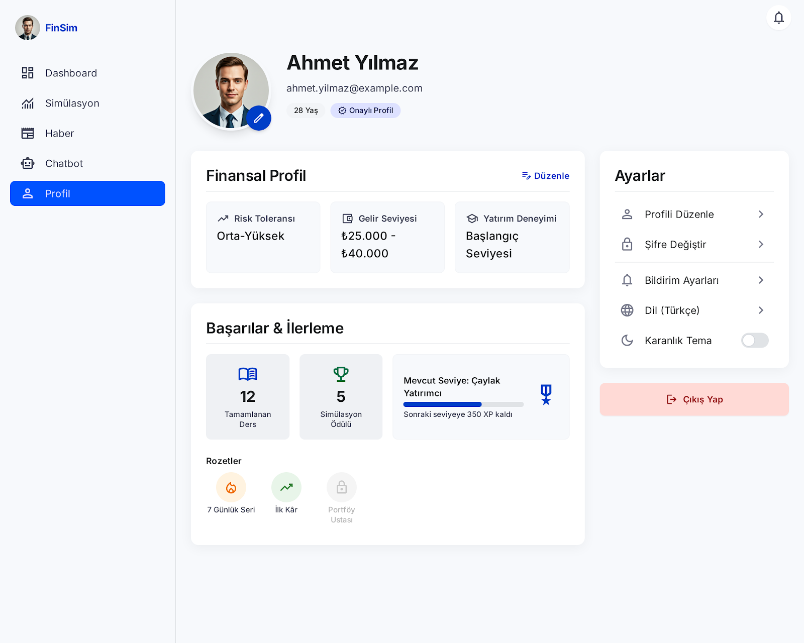

## Hedef Kitle
* 18–35 yaş arası gençler ve genç profesyoneller
* Finansal okuryazarlığını geliştirmek isteyen bireyler
* Borsaya ve yatırım dünyasına yeni adım atan kullanıcılar
* Gerçek para riski olmadan yatırım deneyimi kazanmak isteyen kişiler
* Güncel piyasa gelişmelerini takip ederek bilinçli finansal kararlar almak isteyen kullanıcılar

---

## Kullanılacak Teknolojiler ve Mimari
Projemiz, temiz kod prensipleri ve modern yapay zeka orkestrasyonu gözetilerek geliştirilmektedir.

* **Proje Yönetimi ve Tasarım:** GitHub, Trello, Figma
* **Backend Framework:** FastAPI, Uvicorn (Asenkron mimari, Dependency Injection)
* **Yapay Zekâ ve LLM:** Google Gemini 2.5 Flash, HuggingFace (`all-MiniLM-L6-v2`)
* **RAG Orkestrasyonu:** LangChain v0.3, ChromaDB (Vektör Veritabanı)
* **Kalıcı Veritabanı:** MongoDB Atlas (Motor async driver)
* **Veri İşleme:** PyMuPDF, Pydantic v2
* **Finansal Veri API'leri:** (İlerleyen sprintlerde entegre edilecek)

---

## Proje Yönetimi ve Sprint Kanıtları

* **Product Backlog URL:** [Team101 Trello Board](https://trello.com/invite/b/6a3d8286def1d4972225c9b8/ATTI1dc614b3193520b51446148521c146a8DF7982DE/sprintplan)

<strong>Sprint 1</strong>

### Sprint 1 Çıktıları
* **Backlog Düzeni ve Story Seçimleri:** İlk sprint için ekip kapasitesine uygun puanlamalar yapılmış, Story'ler mantıksal Task'lere bölünmüştür.
* **Daily Scrum Notları:** Takım içi iletişim günlük olarak yürütülmektedir. (Toplantı notları repodaki ilgili klasöre eklenecektir)[cite: 2].
* **Sprint Board Durumu:** 

* **Ürün Durumu:**  Sprint 1 itibarıyla yapay zeka tarafında RAG (Retrieval-Augmented Generation) mimarisinin temelleri atılmış; LangChain ve Gemini entegrasyonu ile finansal dokümanları okuyup Sokratik cevaplar üreten API endpoint'leri çalışır hale getirilmiştir. Veritabanı tarafında MongoDB bağlantısı altyapısı kurulmuş olup, veri tablolarının (koleksiyonların) oluşturulması ve sohbet hafızasının eklenmesi sonraki sprintlere planlanmıştır[cite: 2].
* **Detaylı Teknik Dokümantasyon:** Projenin mimari detayları ve geliştirme günlüğü için ana dizindeki `Fin101_Technical_Doc.md` dosyası incelenebilir.

### Daily Scrum Ekran Görüntüleri

  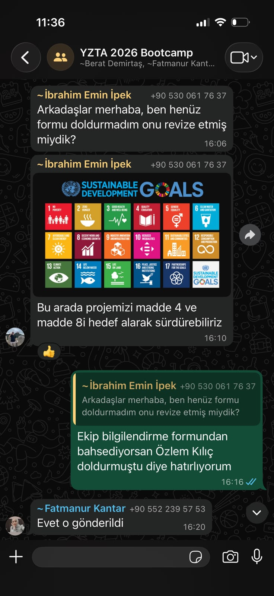
  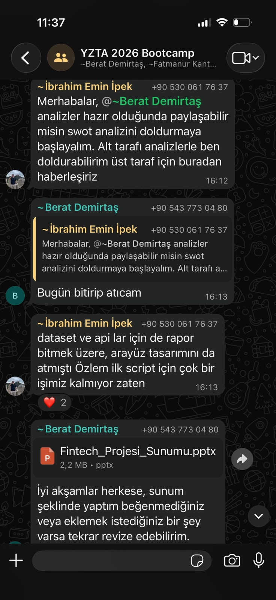
  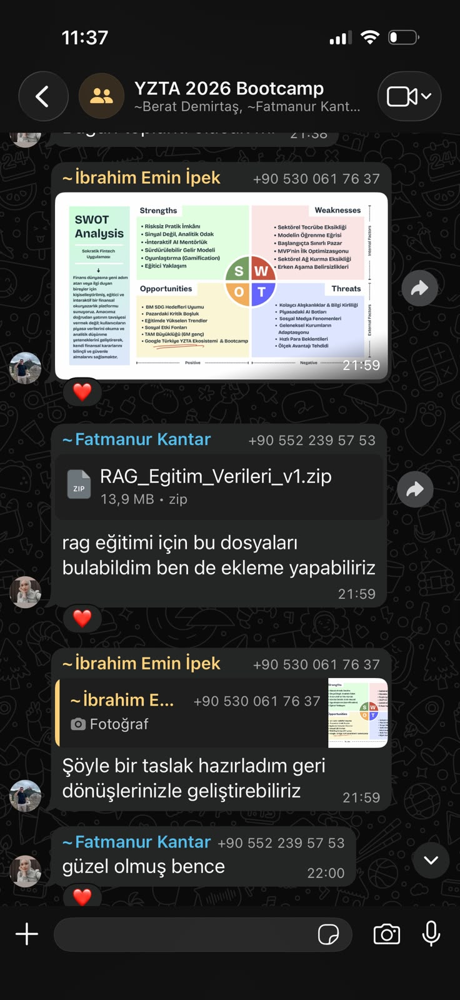

  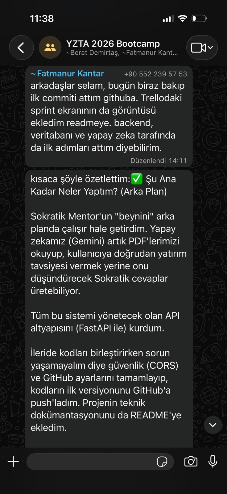
  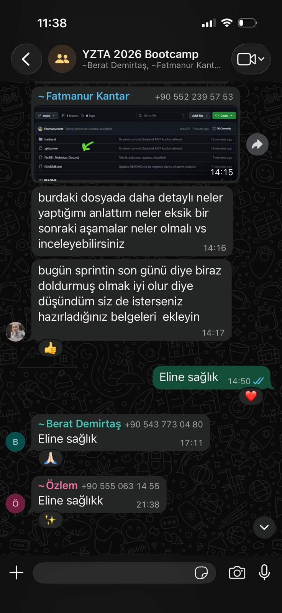
  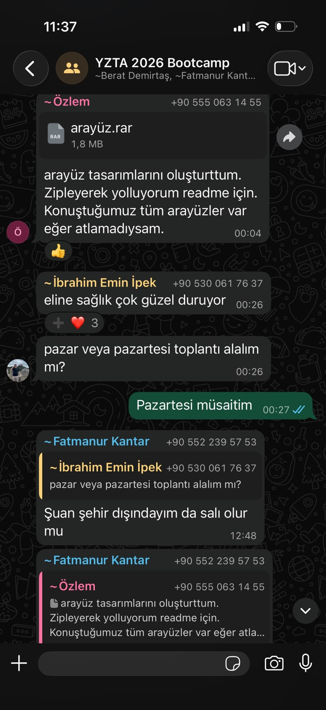

### Sprint Review 

Sprint 1 kapsamında projenin temel backend mimarisi başarıyla oluşturulmuştur. FastAPI tabanlı REST API altyapısı geliştirilmiş, MongoDB Atlas ile asenkron veritabanı bağlantısı kurulmuş ve Pydantic v2 ile veri doğrulama yapısı hazırlanmıştır. Yapay zekâ tarafında Google Gemini 2.5 Flash, LangChain ve ChromaDB kullanılarak RAG (Retrieval-Augmented Generation) mimarisi hayata geçirilmiş; PDF dokümanlarını analiz ederek kullanıcıya yatırım tavsiyesi vermek yerine Sokratik yaklaşımla bilgilendirici yanıtlar üretebilen chatbot altyapısı tamamlanmıştır.

Sistem performansını ve sürdürülebilirliğini artırmak amacıyla LLM cache mekanizması, FastAPI Dependency Injection yapısı, CORS middleware entegrasyonu ve güvenli `.gitignore` yapılandırması uygulanmıştır. ChromaDB için kalıcı depolama altyapısı oluşturulmuş, PyMuPDF ile PDF okuma sistemi geliştirilmiş ve modüler proje mimarisi hazırlanmıştır.

Proje yönetimi tarafında GitHub deposu oluşturulmuş, teknik dokümantasyon hazırlanmış, Trello sprint panosu güncellenmiş ve uygulamanın arayüz tasarımları tamamlanmıştır. Sprint sonunda backend MVP (Minimum Viable Product) tamamlanmış ve proje frontend entegrasyonuna hazır duruma getirilmiştir. Sohbet geçmişi yönetimi, kimlik doğrulama, frontend geliştirmeleri ve finansal veri API entegrasyonları ise sonraki sprintlere aktarılmıştır.

### Sprint Retrospective 

#### İyi Yapılanlar

* Backend MVP planlanan kapsamda başarıyla tamamlandı.
* RAG mimarisi, Google Gemini, LangChain ve ChromaDB entegrasyonları çalışır hâle getirildi.
* FastAPI tabanlı modüler ve ölçeklenebilir proje mimarisi oluşturuldu.
* MongoDB Atlas bağlantısı, CORS yapılandırması ve güvenlik önlemleri başarıyla uygulandı.
* Teknik dokümantasyon, GitHub deposu ve Trello süreç yönetimi düzenli şekilde sürdürüldü.
* Uygulamanın temel arayüz tasarımları hazırlanarak frontend geliştirme süreci için hazır hâle getirildi.

#### Geliştirilebilecek Noktalar

* React/Vite tabanlı frontend geliştirilerek backend ile tam entegrasyon sağlanacaktır.
* Kullanıcı kimlik doğrulama (JWT) ve yetkilendirme sistemi eklenecektir.
* Sohbet geçmişi (chat memory) MongoDB üzerinde yönetilecek ve kullanıcı deneyimi geliştirilecektir.
* Finansal veri API'leri sisteme entegre edilerek gerçek zamanlı piyasa verileri sunulacaktır.
* Test süreçleri, global hata yönetimi, rate limiting ve Docker desteği eklenerek sistem üretim ortamına daha hazır hâle getirilecektir.

<strong>Sprint 2</strong>

### Sprint 2 Çıktıları
* **Backlog Düzeni ve Story Seçimleri:** Sprint 2 kapsamında frontend geliştirmeleri, sohbet hafızası, finansal veri API entegrasyonları ve backend–frontend bağlantısı önceliklendirilmiştir. User Story'ler ekip üyelerine dağıtılmış ve görevler teknik Task'lere ayrılmıştır.
* **Daily Scrum Notları:** Takım içi iletişim düzenli olarak sürdürülmüş, yapılan çalışmalar ve karşılaşılan problemler günlük takip edilmiştir. Toplantı notları ve ekran görüntüleri repodaki ilgili klasöre eklenmiştir.
* **Ürün Durumu:** Sprint 2 itibarıyla uygulamanın temel frontend arayüzleri geliştirilmiş ve backend servisleriyle bağlantıları kurulmuştur. Chatbot, Dashboard, Haberler ve Profil sayfalarının temel yapıları hazırlanmıştır. Chatbot tarafında kullanıcıların konuşmalarının oturum bazlı olarak saklanabilmesi için MongoDB üzerinde sohbet hafızası sistemi geliştirilmiştir.
Finansal veri entegrasyonu kapsamında anlık hisse fiyatlarının, tarihsel piyasa verilerinin, genel piyasa haberlerinin ve şirket bazlı haberlerin alınabilmesi için gerekli API endpoint'leri oluşturulmuştur. Backend ile frontend arasındaki iletişimi yönetmek amacıyla merkezi bir servis katmanı hazırlanmıştır.

### Daily Scrum Ekran Görüntüleri

  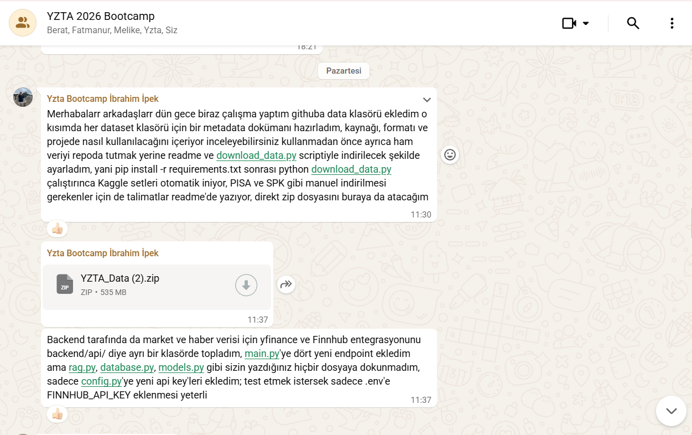
  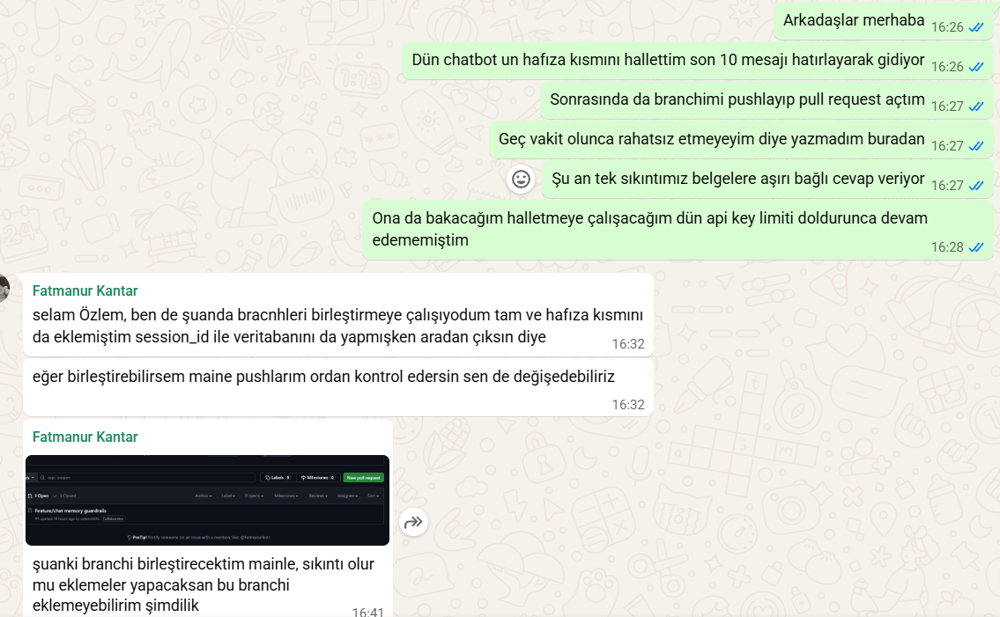
  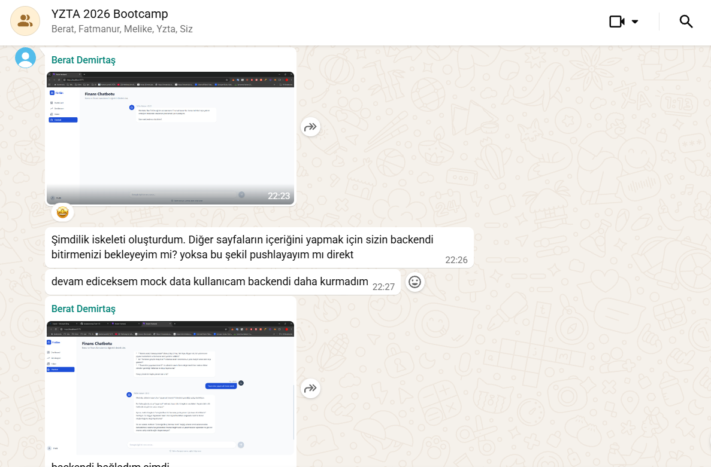
  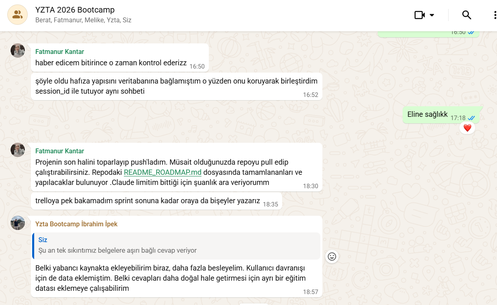

### Sprint 2 Review

Sprint 2 kapsamında uygulamanın backend altyapısı geliştirilmiş ve temel frontend sayfaları oluşturularak backend servisleriyle entegre edilmiştir. React ve Vite kullanılarak Dashboard, Haberler, Chatbot ve Profil sayfalarının temel arayüzleri hazırlanmıştır.

Chatbot modülünde kullanıcıların konuşmalarını oturum bazlı sürdürebilmesi amacıyla session_id yönetimi geliştirilmiştir. Konuşmalar ve mesajlar MongoDB üzerindeki conversations ve messages koleksiyonlarında saklanarak sohbet hafızası sisteme eklenmiştir. RAG tabanlı chatbot altyapısı bu hafıza sistemiyle birleştirilmiş ve kullanıcıların önceki mesajları dikkate alınarak yanıt üretilebilmesi sağlanmıştır.

Kullanıcı ve asistan mesajlarının güvenliğini kontrol etmek amacıyla giriş ve çıkış guardrail mekanizmaları uygulanmıştır. Chatbot cevaplarının frontend üzerinde daha okunabilir gösterilebilmesi için Markdown desteği ve yazı yazma animasyonu eklenmiştir.

Finansal veri tarafında yfinance kullanılarak anlık hisse fiyatı ve tarihsel OHLCV verilerini döndüren endpoint'ler geliştirilmiştir. Finnhub API entegrasyonu ile genel piyasa haberleri ve şirket bazlı haberler sisteme dahil edilmiştir. Frontend tarafında oluşturulan merkezi api.js servis katmanı üzerinden chatbot, piyasa fiyatları, tarihsel veriler ve haber servislerine erişim sağlanmıştır.

Dashboard sayfasında anlık hisse fiyatlarını gösteren kartlar oluşturulmuş, Haberler sayfası gerçek API verileriyle çalışacak şekilde geliştirilmiş ve haberler için kategori filtreleme özelliği eklenmiştir. Profil sayfasının temel arayüzü hazırlanmış ancak kullanıcı kimlik doğrulama sistemi henüz tamamlanmadığı için profil verileri geçici olarak statik tutulmuştur.

Sprint sonunda temel frontend–backend entegrasyonu, sohbet hafızası ve finansal veri servisleri tamamlanmıştır. Kullanıcı kimlik doğrulama sistemi, dinamik profil yönetimi ve sanal borsa simülasyonu ise Sprint 3 kapsamına aktarılmıştır.

### Sprint 2 Retrospective

#### İyi Yapılanlar

* Temel frontend mimarisi başarıyla oluşturuldu.
* Frontend ve backend arasındaki iletişim için merkezi API servis katmanı hazırlandı.
* Chatbot için session_id tabanlı sohbet yönetimi uygulandı.
* Konuşmalar ve mesajlar MongoDB üzerinde saklanarak sohbet hafızası tamamlandı.
* RAG sistemi sohbet hafızasıyla entegre edildi.
* Kullanıcı girdileri ve asistan çıktıları için guardrail kontrolleri eklendi.
* Yfinance ile anlık ve tarihsel piyasa verileri sisteme entegre edildi.
* Finnhub ile piyasa ve şirket haberleri uygulamaya dahil edildi.
* Dashboard ve Haberler sayfaları gerçek API verileriyle çalışır hâle getirildi.

#### Geliştirilebilecek Noktalar

* Sabit olarak kullanılan demo kullanıcı bilgileri gerçek kullanıcı hesaplarıyla değiştirilecektir.
* Profil sayfası MongoDB üzerindeki gerçek kullanıcı verileriyle eşleştirilecektir.
* Kullanıcıların profil bilgilerini düzenleyebileceği form yapısı eklenecektir.
* Borsa simülasyonu sayfası gerçek piyasa verileri ve sanal bakiye sistemiyle aktif hâle getirilecektir.
* Sanal hisse alım-satım işlemleri ve kullanıcı portföyü için gerekli backend endpoint'leri geliştirilecektir.
* Dashboard sayfasına kullanıcı portföy özeti ve kâr/zarar bilgileri eklenecektir.
* Test coverage, global hata yönetimi, rate limiting ve deployment çalışmaları tamamlanacaktır.

